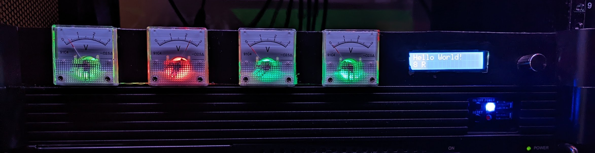
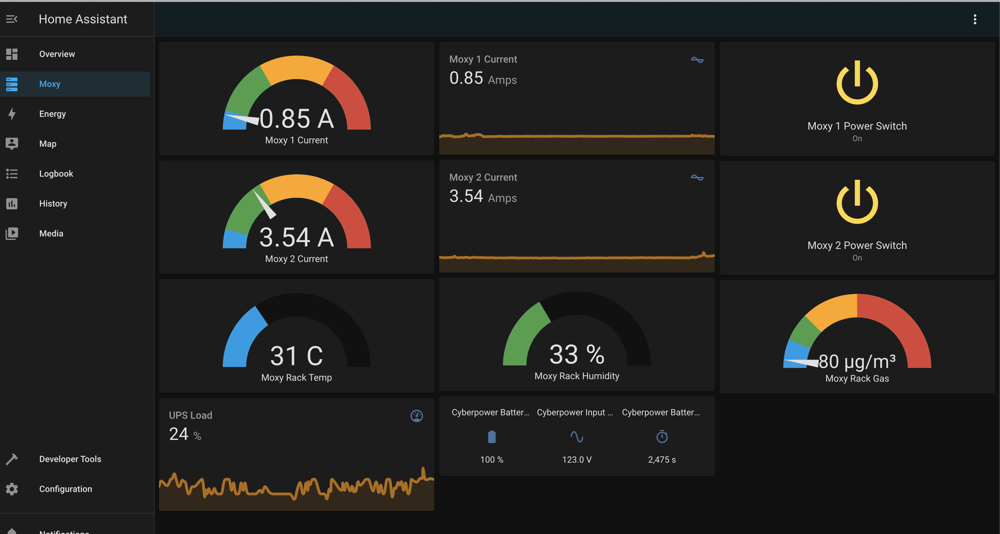

# Moxy - Homelab IoT Platform

<sub><sup>*Front panel interface: PWM-controlled panel meters, LCD screen, and rotary encoder*</sup></sub>

<sub><sup>*Home Assistant interface: communication coordinated via MQTT*</sup></sub>

## Overview
Moxy is a Homelab IoT "Platform" (for lack of a better term) that blurs the lines between hardware and software in the homelab. Here are the principal components of the platform:
* Centralized server power management using relays and current sensors
* Environmental sensors reporting real time metrics from the homelab
* Physical "dashboard" to display guages using old-fashioned panel meters, backlit by neopixels for extra color indication

## Prerequisites
### Server-side
* MQTT
* Python 3
* I2C - to connect to microcontrollers and ADCs for sensors, analog meters (pwm), and LCD screen
* GPIO - for controlling relays and rotary encoder input
* Home Assistant

### Device-side
* 5 ADC pins
* 4 PWM pins
* 16x2 I2C LCD Screen
* 4x 30V 10A relays w/ optocouplers
* 4x ACS712 Hall-effect current sensors
* DHT11 temperature + humidity sensor
* MQ2 gas sensor
* Arduino-compatible microcontrollers

## Installing as a service
A bash script is included to assist in creating services for server-side components in ````systemd````. See below for helpful commands on managing the services.

### Linux installation
1. Modify service definitions in ````service_definitions```` directory to reflect the location of the Python executables
2. Copy ````config.ini.sample```` to ````config.ini```` and replace values for your MQTT broker
3. Run ````./install_systemd_services.sh```` - if successful, script will automatically start tailing journalctl logs to verify the services started successfully

## Helpful Commands
### Tail all logs
```bash
journalctl --follow _SYSTEMD_UNIT=moxy.relays.service + _SYSTEMD_UNIT=moxy.sensors.service + _SYSTEMD_UNIT=moxy.panel.service
```

### Tail individual log
```bash
journalctl -u moxy.{serviceName}.service -f
```

### Restart all services
```
systemctl restart moxy.panel.service
systemctl restart moxy.sensors.service
systemctl restart moxy.relays.service
```